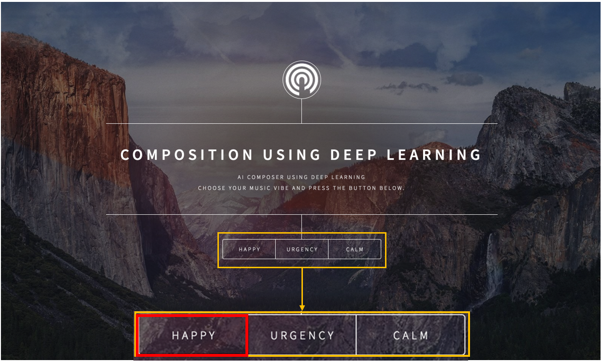
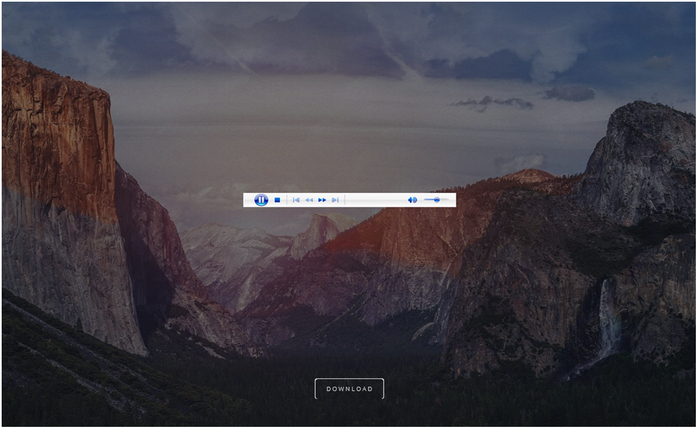
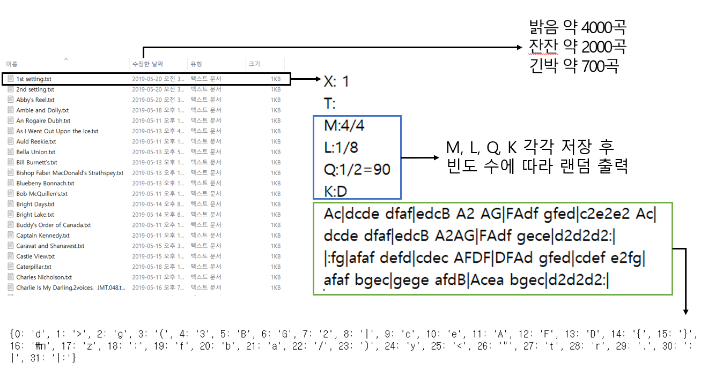
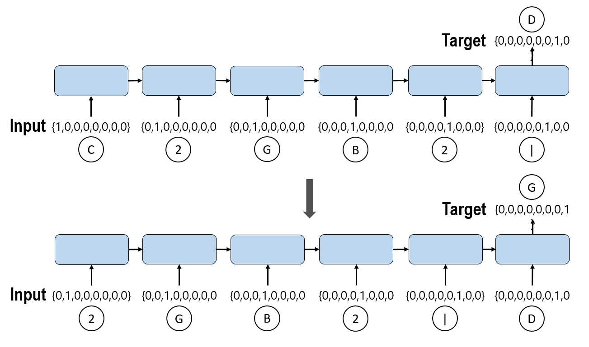
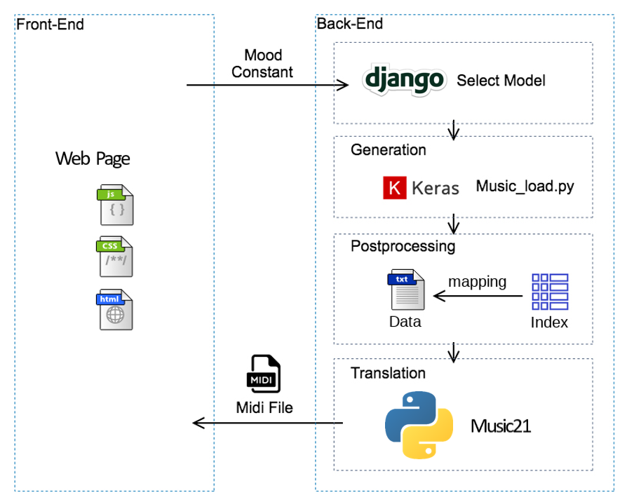

# [2019] 딥러닝을 이용한 BGM 작곡 설계 및 구현

## 개요
프로젝트 이름: 딥러닝을 이용한 음악작곡(Composition Using Deep Learning)

프로젝트 선정이유 : 인디 개발자들의 2차 창작물에 대한 비즈니스적 문제 해소 목적

프로젝트 기간 : 2018.10~2019.09

개발 언어 : Python

사용 라이브러리 : 
* selenim - 웹 스크롤링 라이브러리
* ipykernal - Jupyter Notebook 명령쉘 라이브러리
* tensorflow - 머신러닝,AI 라이브러리
* keras - 뉴런 네트워크 라이브러리
* music21 - 음악 파일 라이브러리

모델 학습 주요코드 : 
* ./music.py - 모델 학습 코드
* ./music_load.py - 학습된 모델 로드 후 답 추출 코드

장고 서버 알고리즘 코드 :
* polls/views.py - 모델 로드 후 답을 추출하여 웹 서비스 코드
  

(<a href="#readme-top">back to top</a>)

## 작품설명
초기화면 작업후 다운로드화면

(<a href="#readme-top">back to top</a>)

## 기술설명
1) 사용 데이터 : abc notation

2) 학습 모델 : LSTM

3) 서비스 시스템 구성

(<a href="#readme-top">back to top</a>)

## 결과 음악
* happy
  

https://github.com/helloJosh/Composing-Using-Deep-Learning/assets/37134368/e8739b4d-e72e-46db-9114-fddfa9e1fb9a

* calm
  

https://github.com/helloJosh/Composing-Using-Deep-Learning/assets/37134368/ccb3006c-35f7-4a35-91b1-cd446958194b

* urgency

https://github.com/helloJosh/Composing-Using-Deep-Learning/assets/37134368/96f97a57-e7a9-4cfb-88d9-9b8724857249

### 첨부 논문
[Design and Implementation of BGM Composition Service Using Deep Learning.pdf](https://github.com/helloJosh/Composing-Using-Deep-Learning/files/13207383/Design.and.Implementation.of.BGM.Composition.Service.Using.Deep.Learning.pdf)

